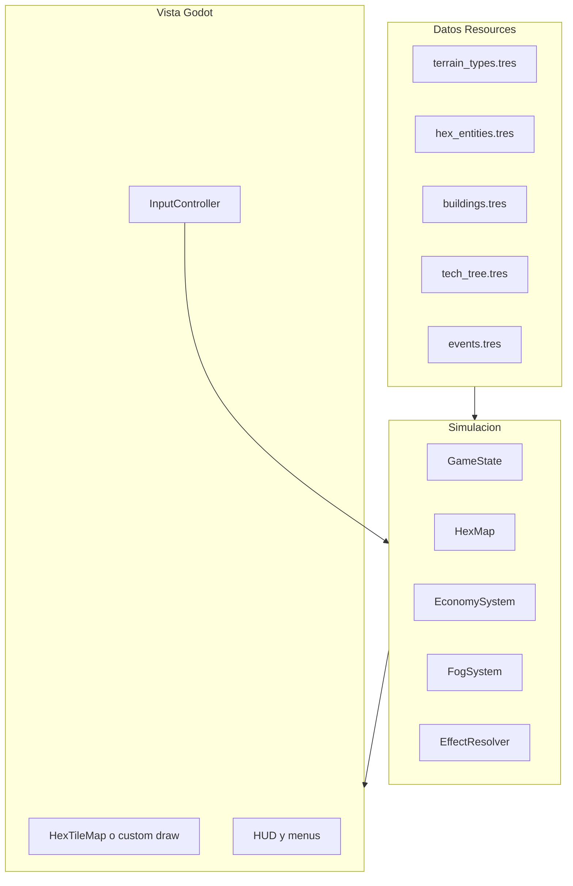

# Plan: clon de Townsfolk para aprender (Godot 4, PC)

## Contexto y expectativa realista

**Townsfolk** (Short Circuit Studio) es un roguelite de construcción en tablero hexagonal con recursos (Comida, Oro, Fe, Producción), niebla exploratoria, edificios con reglas de terreno, eventos y árbol de investigación. Tu descripción encaja con el juego comercial.

**Sí se puede llegar a un juego completo**, pero no de un golpe: el plan divide el trabajo en **12–18 semanas** de aprendizaje (ritmo hobby, 5–10 h/semana). Cada fase deja un ejecutable jugable y conceptos que puedes extender solo.

**Recomendación de stack** (elegiste “otro / recomiéndame” + PC):

| Criterio | Godot 4 + GDScript |
|----------|------------------|
| 2D pixel + hex | Muy usado en la comunidad |
| Curva de aprendizaje | Más suave que Unity para un primer juego |
| Desktop | Export nativo Win/Mac/Linux |
| Arquitectura moderna | Escenas, señales, recursos `.tres`, autoloads |

Alternativa válida si ya dominas C#: Unity. Para este proyecto, **Godot 4** es la mejor relación aprendizaje/resultado.

**Aviso legal/educativo:** recrear *mecánicas* para aprender está bien; no copies sprites, música, nombres de edificios ni código del original. Usa **arte placeholder** (Kenney, itch.io CC0) o pixel art propia; renombra edificios/eventos si publicas algo.

**Workspace del proyecto:** [`/Users/rcruz2/Developer/Cloud/Townsfolk`](/Users/rcruz2/Developer/Cloud/Townsfolk) — ya inicializado con **Git** y **uv** (`pyproject.toml`, Python 3.13).

**Instalación de Godot 4 (macOS):** elegir **Universal** (a veces aparece como “Godot Engine” sin la palabra .NET). Esa versión usa **GDScript** nativo, que es la del plan. La variante **.NET** exige instalar el SDK de .NET y programar principalmente en **C#**; solo tiene sentido si ya dominas C# y quieres ese lenguaje. Ambas comparten el editor visual; los proyectos no son 100% intercambiables sin migrar scripts.

---

## Repo híbrido: Godot + Python (uv)

El juego corre en Godot; Python queda para **herramientas** que encajan bien con `uv`:

- Validar y exportar JSON de balance (`data/*.json`) antes de copiarlos al juego.
- Tests unitarios de `hex_math` en Python (misma lógica que luego portas a GDScript, o generación de casos).
- Scripts de playtest / simulación rápida de economía (sin abrir el editor).

No mezclar el runtime del juego con Python: Godot no ejecutará `main.py` en producción.

---

## Arquitectura objetivo (cómo lo enseñaríamos)

Separar **datos** (qué existe), **simulación** (qué pasa cada turno/día) y **presentación** (sprites, UI, sonido). Así añadir “cientos de detalles” es sumar filas en datos, no reescribir el motor.



**Piezas clave:**

- `GameState`: recursos, día, puntos de investigación, misiones activas.
- `HexMap`: mapa en coordenadas **axiales** (q, r); cada celda = terreno + lista de entidades + edificio opcional + estado de niebla.
- `EffectResolver`: aplica modificadores (+personas, −comida, bonus por proximidad) leyendo definiciones, no `if granja then...` dispersos.
- **Data-driven**: cada terreno/edificio/evento = `Resource` o JSON con campos: `allowed_terrains`, `base_effects`, `adjacency_rules`, `cost_to_interact`.

---

## Fases del plan (orden estricto)

### Fase 0 — Entorno y “hola hex” (semana 1)

**Objetivo:** proyecto Godot 4 vacío que dibuja un mapa hex clickeable.

- Instalar Godot 4.x **Universal**, abrir o crear el proyecto en subcarpeta `game/` dentro del repo Townsfolk.
- Proyecto 2D, resolución base 320×180 o 480×270 (pixel art escalado con `stretch_mode = viewport`).
- Implementar **coordenadas axiales** y conversión pantalla ↔ hex (funciones puras en `hex_math.gd`).
- Dibujar 5–7 tipos de terreno con **colores placeholder** (fértil, desierto, pobre, nieve, montaña, océano).
- Click en hex: resaltar y mostrar coordenadas en UI.

**Aprendizaje:** matemática hex, separación lógica/vista, escenas Godot.

**Criterio de hecho:** mapa procedural pequeño (radio 8–12), sin reglas de juego aún.

---

### Fase 1 — Modelo de celda y generación (semana 2)

**Objetivo:** cada hex tiene tipo + “cosas” opcionales.

- Estructura `HexCell`: `terrain_id`, `entities[]`, `building_id`, `fog_state` (hidden / revealed / visible).
- Generador simple: ruido o reglas (océano en bordes, montaña en clusters, etc.).
- Catálogo `TerrainDef`: id, nombre, sprite_key, `build_tags` (ej. `fertile`, `mining`, `water`).

**Aprendizaje:** generación procedural ligera, enums/diccionarios, serialización.

**Criterio de hecho:** al iniciar partida, mapa coherente y estable (misma seed = mismo mapa).

---

### Fase 2 — Niebla y exploración con coste creciente (semana 3)

**Objetivo:** replicar “no se ve al inicio; revelar cuesta y sube con la distancia”.

- Estado inicial: solo hex del asentamiento visible; resto `hidden`.
- Acción **Explorar**: revelar hex adyacente; coste = `base + k * distance_from_start` (o BFS depth).
- Gráficos: tile oscuro / silueta / completo según `fog_state`.
- Gastar recurso “Producción” o “Fe” según diseño (alineado a Townsfolk: Producción para trabajo).

**Aprendizaje:** BFS en hex, diseño de curva de coste, feedback visual.

**Criterio de hecho:** jugador puede expandir mapa hasta agotar recurso; costes suben de forma perceptible.

---

### Fase 3 — Economía y ciclo día/turno (semana 4)

**Objetivo:** barra de recursos y resolución automática por día.

Recursos MVP (mapeo a Townsfolk):

| Tu nombre | En juego | Rol |
|-----------|----------|-----|
| Personas | Población | Capacidad / consumo |
| Comida | Food | Supervivencia |
| Capacidad de trabajo | Production | Explorar, construir, misiones |
| Fe | Faith | Eventos / edificios religiosos |
| Dinero | Gold | Tributo, mejoras |

- `EconomySystem.tick_day()`: suma ingresos/gastos de todas las celdas reveladas + penalizaciones globales.
- HUD: iconos + números + delta previsto (“+3 / −5”).
- **Game over** si comida &lt; 0 o población = 0.

**Aprendizaje:** sistemas de simulación, UI data-binding con señales.

**Criterio de hecho:** pasar días manualmente; recursos cambian sin edificios (solo terreno base opcional).

---

### Fase 4 — Entidades en hex e interacciones (semanas 5–6)

**Objetivo:** árboles, animales domésticos/salvajes; coste y efecto al interactuar.

- `HexEntityDef`: `type` (tree, livestock, prey, predator), `interact_cost`, `interact_effects[]`, `spawn_weights` por terreno.
- Colocar entidades en generación o al revelar niebla.
- Panel contextual al seleccionar hex: lista de acciones (Talar, Cazar, Domesticar…) según entidades presentes.
- Eliminar o transformar entidad tras interacción.

**Aprendizaje:** FSM ligera por entidad, diseño de coste/beneficio, UX de acciones.

**Criterio de hecho:** 8–12 entidades jugables; balance “a ojo” documentado en hoja.

---

### Fase 5 — Construcción y reglas de terreno (semanas 7–8)

**Objetivo:** edificios con restricciones (granja ≠ montaña, mina = montaña, etc.).

- `BuildingDef`: `allowed_terrain_tags`, `efficiency_by_terrain` (ej. granja 100% fértil, 50% desierto, 0% montaña), `effects_per_day`, `build_cost`.
- Modo construcción: elegir edificio → resaltar hex válidos/inválidos → confirmar → gastar Production/Gold.
- 10–15 edificios MVP: casa, casa mejorada, granja, molino, mina, iglesia, aserradero, etc.

**Aprendizaje:** validación declarativa, feedback de errores en UI.

**Criterio de hecho:** no se puede colocar ilegalmente; eficiencia cambia producción.

---

### Fase 6 — Efectos por proximidad y apilamiento (semana 9)

**Objetivo:** molino potencia granjas adyacentes; efectos que se suman.

- `AdjacencyRule`: `source_building`, `target_building`, `radius`, `modifier` (+% producción, +personas, etc.).
- `EffectResolver` recalcula bonos cada día o al colocar edificio (preview al colocar).
- Debug overlay opcional: líneas entre hex bonificados.

**Aprendizaje:** consultas en vecinos hex (6 direcciones), invalidación de caché.

**Criterio de hecho:** al menos 5 reglas de proximidad funcionando y visibles en tooltip.

---

### Fase 7 — Eventos y elecciones (semanas 10–11)

**Objetivo:** eventos buenos/malos/neutrales con coste/beneficio según elección.

- `EventDef`: condiciones (`min_day`, `requires_faith`), `choices[]` con `effects` y textos.
- Cola de eventos: X% por día + eventos forzados por misión.
- Ventana modal pausa simulación hasta elegir.

**Aprendizaje:** scripting de contenido, localización futura (`tr()`).

**Criterio de hecho:** 15–20 eventos; partida de 30 días siente variabilidad.

---

### Fase 8 — Investigación y misiones (semanas 12–13)

**Objetivo:** árbol tech con puntos; misiones dan puntos/eventos.

- `TechNode`: prerequisitos, coste en puntos, `unlocks` (nuevo edificio, +% casa, etc.).
- Puntos por: completar misión, evento, hito (día 10, población 20).
- UI árbol simple (lista o grafo 2D) — no hace falta gráfico fancy al inicio.

**Aprendizaje:** grafos acíclicos, persistencia de desbloqueos en `RunState`.

**Criterio de hecho:** investigar “casas mejoradas” cambia stats de `BuildingDef` vía flags.

---

### Fase 9 — Meta roguelite: tributo, run y balance (semanas 14–16)

**Objetivo:** acercarse al loop completo de Townsfolk.

- **Tributo al rey** cada N días: exige Gold; fallar = penalización fuerte o fin de run.
- **Run**: semilla, dificultad, fin victoria/derrota; pantalla resumen.
- Opcional: meta-progresión entre runs (desbloquear edificios iniciales) — simplificar al principio.
- Playtest: hoja de balance (CSV o Google Sheet) exportada a JSON para iterar sin tocar código.

**Criterio de hecho:** partida completa 45–60 min jugable de principio a fin.

---

### Fase 10 — Arte, audio y pulido (semanas 17–18+)

- Sustituir placeholders por tileset 8-bit coherente (tamaño tile 16×16 o 32×32).
- Animaciones mínimas (humo molino, bandera).
- Música/SFX libres (Freesound, OpenGameArt).
- Guardado (`user://save.json`), opciones, tutorial in-game 3 pasos.

---

## Estructura de carpetas propuesta

```
/Users/rcruz2/Developer/Cloud/Townsfolk/
  pyproject.toml          # uv — herramientas Python
  tools/                  # scripts Python (export JSON, tests hex)
  game/                   # proyecto Godot 4 (abrir esta carpeta en el editor)
    project.godot
    scenes/
      main.tscn
      ui/hud.tscn
      map/hex_map_view.tscn
    scripts/
      core/hex_math.gd
      core/game_state.gd
      systems/economy.gd
      systems/fog.gd
      systems/effects.gd
      systems/events.gd
    data/                 # JSON consumidos por Godot (copia validada desde tools/)
    assets/
  docs/
    GDD.md
    BALANCE.csv
  README.md
```

---

## Cómo trabajaríamos juntos (metodología)

1. **Una fase por conversación/sprint** — no saltar fases; cada una es jugable.
2. Por sesión: yo explico el concepto → tú escribes parte del código → revisión y tests manuales checklist.
3. Mantener [`docs/GDD.md`](docs/GDD.md) con tablas de terrenos/edificios (fuente de verdad).
4. Commits pequeños: `feat(hex): axial pick`, `feat(fog): reveal cost curve`.

---

## MVP vs “juego completo”

| Alcance | Incluye |
|---------|---------|
| **MVP (fases 0–7)** | Mapa hex, niebla, 4–5 recursos, ~15 edificios, entidades, eventos, día/turno |
| **Completo (fases 8–10)** | Tech tree profundo, tributo, misiones, roguelite, arte final, muchos eventos/edificios |

El MVP ya **se parece a Townsfolk** en el loop principal; el resto es contenido y pulido.

---

## Riesgos y mitigaciones

- **Scope creep** (“cientos de detalles”): todo nuevo edificio = entrada JSON; límite 2 edificios nuevos por semana hasta Fase 9.
- **Balance imposible sin datos**: exportar métricas al final de cada día (log CSV).
- **Hex bugs**: tests unitarios en `hex_math.gd` (vecinos, distancia, ring).
- **Copia del original**: mecánicas sí, IP no.

---

## Primer paso inmediato (cuando salgas de plan mode)

1. Descargar e instalar **Godot 4.x Universal** desde [godotengine.org](https://godotengine.org/download/).
2. En el repo existente: crear `game/` con “Nuevo proyecto” de Godot; añadir `docs/GDD.md` y `README.md` en la raíz.
3. Opcional Fase 0 paralela: `tools/hex_test.py` con `uv run` para probar coordenadas axiales antes de portar a `game/scripts/core/hex_math.gd`.
4. Implementar Fase 0 en Godot: hex clickeable con 7 colores placeholder.

**Cursor / agente:** abrir como workspace `/Users/rcruz2/Developer/Cloud/Townsfolk` (no el directorio de catálogo de servicios).
