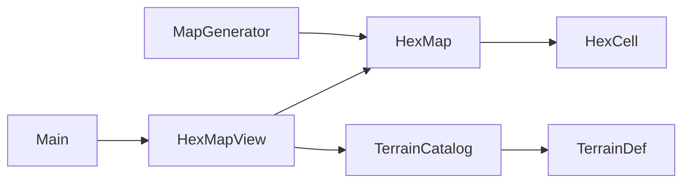

# WP-001: Modelo HexCell y generación con semilla

| Campo | Valor |
|-------|--------|
| Fase PLAN | Fase 1 — Modelo de celda y generación |
| Estado | **listo** |
| Autor arquitecto | Arquitecto (chat principal) |
| Fecha | 2026-05-24 |
| Prompt implementador | [001-PROMPT-implementador.md](001-PROMPT-implementador.md) |

---

## Objetivo

Separar **modelo** (qué hay en cada hexágono) de **vista** (cómo se dibuja). Al iniciar partida, un generador determinista rellena un `HexMap` con celdas `HexCell` (terreno, campos reservados para entidades/edificios/niebla). La misma semilla y radio deben producir **exactamente** el mismo mapa.

El jugador sigue viendo el mapa de colores de la Fase 0 y puede hacer clic; el HUD muestra coordenadas y nombre del terreno.

---

## Alcance

### Incluido

- Clase `HexCell` con: `terrain_id`, `entities`, `building_id`, `fog_state`.
- Enum `FogState`: `HIDDEN`, `REVEALED`, `VISIBLE` (en Fase 1 todas las celdas generadas en `VISIBLE`; la lógica de niebla es Fase 2).
- Recurso o clase `TerrainDef`: `terrain_id`, `display_name`, `sprite_key`, `build_tags`, `color` (placeholder visual).
- `TerrainCatalog`: catálogo estático de los **7** terrenos actuales (mismos colores/nombres que `TerrainDefs` hoy).
- `MapGenerator`: generación procedural movida desde `hex_map_view.gd`; determinista por `seed` + `radius`.
- `HexMap`: contenedor `Dictionary[Vector2i, HexCell]`, API `generate`, `get_cell`, `has_cell`, `get_cell_count`.
- Refactor de `hex_map_view.gd`: solo lectura de `HexMap` + dibujo + input; **sin** lógica de `_pick_terrain`.
- Comentarios `##` en toda API pública nueva (ver [CONVENTIONS.md](../CONVENTIONS.md)).
- HUD: al seleccionar, mostrar `(q, r)`, nombre de terreno y `fog` (texto legible, p. ej. `visible`).

### Excluido (no hacer en este paquete)

- Niebla jugable (ocultar hex, coste de exploración) — Fase 2.
- Entidades en hex (`entities` siempre array vacío al generar).
- Edificios (`building_id` siempre cadena vacía `""` o equivalente “ninguno”).
- Archivos `.tres` en editor, tilesets, sprites reales.
- `tools/` Python (opcional; no bloquea el cierre del paquete).
- Economía, eventos, UI nueva más allá del label existente.
- Cambiar resolución, `project.godot` salvo registrar autoload si lo usas (preferible **sin** autoload en este paquete).

---

## Diseño

### Diagrama de dependencias



### Archivos

| Acción | Ruta |
|--------|------|
| Crear | `game/scripts/model/hex_cell.gd` |
| Crear | `game/scripts/model/hex_map.gd` |
| Crear | `game/scripts/core/terrain_def.gd` |
| Crear | `game/scripts/core/terrain_catalog.gd` |
| Crear | `game/scripts/systems/map_generator.gd` |
| Modificar | `game/scripts/map/hex_map_view.gd` |
| Modificar | `game/scenes/main.gd` |
| Modificar | `game/scenes/main.tscn` (solo si hace falta texto HUD) |
| Eliminar o vaciar | `game/scripts/core/terrain_defs.gd` — migrar usos a `TerrainCatalog`; no dejar duplicado |

### `HexCell` (RefCounted o Resource)

| Campo | Tipo | Inicial |
|-------|------|---------|
| `terrain_id` | `String` | obligatorio |
| `entities` | `Array` | `[]` |
| `building_id` | `String` | `""` |
| `fog_state` | `FogState` | `FogState.VISIBLE` al generar |

Opcional: guardar `coords: Vector2i` en la celda para depuración (recomendado).

### `FogState`

```gdscript
enum FogState { HIDDEN, REVEALED, VISIBLE }
```

### `TerrainDef`

| Campo | Tipo | Notas |
|-------|------|--------|
| `terrain_id` | `String` | snake_case inglés, estable |
| `display_name` | `String` | español, UI |
| `sprite_key` | `String` | por ahora igual que `terrain_id` |
| `build_tags` | `PackedStringArray` | ver tabla abajo |
| `color` | `Color` | reutilizar valores actuales de Fase 0 |

### Catálogo de terrenos (obligatorio)

| terrain_id | display_name | build_tags |
|------------|--------------|------------|
| `ocean` | Océano | `water` |
| `fertile` | Fértil | `fertile` |
| `desert` | Desierto | `arid` |
| `poor` | Pobre | `poor` |
| `snow` | Nieve | `cold` |
| `mountain` | Montaña | `mining`, `elevated` |
| `hills` | Colinas | `hills` |

Colores: copiar de la implementación actual en `terrain_defs.gd` antes de borrarla.

### `MapGenerator`

```gdscript
## Genera un HexMap completo.
static func generate(seed: int, radius: int, origin: Vector2i = Vector2i.ZERO) -> HexMap
```

- Usar `HexMath.disk(origin, radius)` para iterar celdas.
- Usar `RandomNumberGenerator` con `rng.seed = seed` (no usar `randi()` global sin semilla).
- Reglas de terreno: **portar** la lógica actual de `_pick_terrain` en `hex_map_view.gd` (borde océano, anillos costeros, interior aleatorio ponderado), pero devolver `terrain_id` string del catálogo, no enum antiguo.
- Mejora permitida (no obligatoria): en interior, si un vecino ya es `mountain`, aumentar probabilidad de `mountain` en ~15% para “clusters” suaves.

### `HexMap`

```gdscript
class_name HexMap
extends RefCounted

var seed: int
var radius: int
var origin: Vector2i
var _cells: Dictionary  # Vector2i -> HexCell

func generate(p_seed: int, p_radius: int, p_origin: Vector2i = Vector2i.ZERO) -> void
func get_cell(coords: Vector2i) -> HexCell  # null o error si no existe — documentar elección
func has_cell(coords: Vector2i) -> bool
func get_cell_count() -> int
func get_all_coords() -> Array[Vector2i]  # para dibujar
```

`generate` delega en `MapGenerator` o lo invoca internamente (una sola fuente de verdad).

### `HexMapView` (contrato)

- `@export var map_seed`, `map_radius`, `hex_size` se mantienen.
- En `_ready`: ` _hex_map = HexMap.new(); _hex_map.generate(map_seed, map_radius)` (o equivalente).
- `_draw`: iterar `_hex_map.get_all_coords()`, color desde `TerrainCatalog.get_color(terrain_id)`.
- Señal `hex_selected(coords, terrain_id, terrain_name)` — puede cambiar firma respecto a Fase 0; actualizar `main.gd`.
- Sin diccionario `_cells` propio de terrenos.

### `main.gd`

- Adaptar a nueva firma de señal.
- Texto HUD ejemplo: `Hex (2, -1) — Fértil · visible`.

---

## Tareas de implementación

1. [ ] Crear `FogState` + `HexCell` en `scripts/model/hex_cell.gd` con `##` completos.
2. [ ] Crear `TerrainDef` + `TerrainCatalog` con los 7 terrenos y tabla de tags.
3. [ ] Crear `MapGenerator` portando reglas de `_pick_terrain`.
4. [ ] Crear `HexMap` e integrar generador.
5. [ ] Refactorizar `hex_map_view.gd` para usar `HexMap` + `TerrainCatalog`.
6. [ ] Actualizar `main.gd` / HUD.
7. [ ] Eliminar `terrain_defs.gd` si ya no hay referencias (buscar en todo `game/`).
8. [ ] Verificar F5 sin errores en consola; documentar funciones públicas.

---

## Criterios de aceptación

- [ ] Con `map_seed = 4242` y `map_radius = 10`, dos ejecuciones seguidas (reiniciar juego) muestran el **mismo** patrón de colores en las mismas coordenadas al hacer clic.
- [ ] Cambiar `map_seed` en el inspector o export cambia el mapa de forma visible.
- [ ] `HexCell` expone los cuatro campos; `entities` vacío y `building_id` vacío en todas las celdas generadas.
- [ ] Todas las celdas generadas tienen `fog_state == VISIBLE`.
- [ ] Cada `terrain_id` del mapa existe en `TerrainCatalog` con `build_tags` no vacíos.
- [ ] No queda lógica de generación de terreno en `hex_map_view.gd`.
- [ ] Godot 4.6+ abre `game/` y F5 sin errores rojos en consola.
- [ ] Toda función/clase pública nueva tiene comentarios `##` en español.

---

## Pruebas manuales

1. Abrir `game/` en Godot 4.6+, F5.
2. Clic en hex central `(0, 0)` — anotar terreno mostrado en HUD.
3. Clic en 3 hexes más en distintas zonas (borde mar, interior).
4. Detener, F5 de nuevo — repetir mismos clics; terrenos deben coincidir.
5. En el nodo `HexMapView`, cambiar `map_seed` a `9999`, F5 — el mapa debe cambiar.
6. Buscar en consola que no aparezcan errores al cargar.

---

## Notas

- Referencia hex: [Red Blob Games — Hex grids](https://www.redblobgames.com/grids/hexagons/).
- Fase 0 completada: `hex_math.gd` no requiere cambios salvo uso desde generador.
- Si el implementador necesita autoload para `TerrainCatalog`, justificar en comentario del PR/commit; preferencia: métodos `static` en `TerrainCatalog` sin autoload.
- Al terminar, el arquitecto actualiza este documento a **hecho** y el índice en `packages/README.md`.
