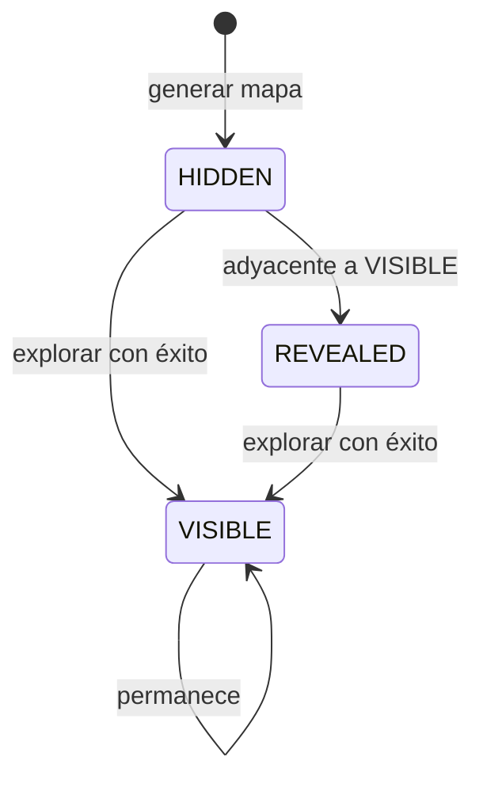

# WP-002: Niebla de guerra y exploración con coste

| Campo | Valor |
|-------|--------|
| Fase PLAN | Fase 2 — Niebla y exploración con coste creciente |
| Estado | **listo** |
| Autor arquitecto | Arquitecto (chat principal) |
| Fecha | 2026-05-24 |
| Depende de | [WP-001](001-hex-cell-y-generacion.md) (**hecho**, prueba manual OK) |
| Prompt implementador | [002-PROMPT-implementador.md](002-PROMPT-implementador.md) |

---

## Objetivo

Al iniciar partida casi todo el mapa está **oculto**; solo el hex del asentamiento (origen) se ve completo. El jugador **explora** hexágonos adyacentes al territorio visible gastando **Producción**; el coste sube con la distancia al origen. La vista refleja tres estados (`oculto` / `revelado` / `visible`) y el HUD muestra producción restante y coste previo al explorar.

---

## Alcance

### Incluido

- `FogSystem`: inicializar niebla tras generar mapa; actualizar estados `REVEALED`; validar y aplicar exploración.
- `ExplorationBudget` (o `RunState` mínimo): contador entero `production` con gasto al explorar (sin tick diario).
- Tras `HexMap.generate`: todas las celdas `HIDDEN` excepto `origin` → `VISIBLE`; luego pasada que marque `REVEALED` en celdas `HIDDEN` adyacentes a alguna `VISIBLE`.
- Coste de exploración: `cost = explore_base_cost + explore_cost_per_ring * distance`, donde `distance = HexMath.axial_distance(target, origin)` (anillo desde el centro).
- Input: clic en hex `HIDDEN` adyacente a al menos una celda `VISIBLE` → si hay producción suficiente, explorar; si no, feedback en HUD (mensaje, sin crash).
- Dibujo en `hex_map_view`: colores distintos por `fog_state` (ver tabla visual abajo).
- HUD: producción actual; al seleccionar frontera explorabile, mostrar coste del hex bajo el cursor o seleccionado.
- Constantes exportadas o en un solo sitio (`explore_base_cost`, `explore_cost_per_ring`, `starting_production`) documentadas con `##`.
- API pública documentada en español (`##`).

### Excluido

- Ciclo día/turno, otros recursos (comida, oro, fe) — Fase 3.
- Entidades, edificios, eventos.
- Niebla que vuelva a ocultar hex ya vistos al “alejarse” la visión (solo subir `HIDDEN`→`VISIBLE`/`REVEALED` permanente).
- Guardado, multijugador, sonido.
- Cambiar generación de terreno o catálogo de terrenos (salvo leer terreno para silueta).

---

## Diseño

### Constantes (valores iniciales sugeridos)

| Constante | Valor | Ubicación sugerida |
|-----------|-------|---------------------|
| `starting_production` | `30` | `ExplorationBudget` o exports en `main` |
| `explore_base_cost` | `2` | `FogSystem` |
| `explore_cost_per_ring` | `1` | `FogSystem` |

Con origen `(0,0)` y radio 10: anillo 1 cuesta 3, anillo 5 cuesta 7, etc. Ajustables vía `@export` en un nodo o `const` documentados.

### Transiciones de niebla



- **Tras explorar** celda objetivo: `fog_state = VISIBLE`.
- **Inmediatamente después**: recalcular `REVEALED` en todas las `HIDDEN` con vecino `VISIBLE` (no sobrescribir `VISIBLE`).

### Tabla visual (hex_map_view)

| FogState | Aspecto |
|----------|---------|
| `HIDDEN` | Relleno gris muy oscuro `Color(0.06, 0.06, 0.09)`; **no** mostrar color de terreno. |
| `REVEALED` | Color de terreno × `0.5` alfa visual (multiplicar RGB por `0.45`). |
| `VISIBLE` | Color de terreno normal (comportamiento actual). |

Borde/selección: igual que Fase 1.

### Exploración (reglas)

1. Celda objetivo debe existir en `HexMap` y estar en `HIDDEN` o `REVEALED` (permitir explorar silueta).
2. Debe existir al menos un vecino axial con `fog_state == VISIBLE`.
3. `cost = explore_base_cost + explore_cost_per_ring * axial_distance(target, hex_map.origin)`.
4. Si `production >= cost`: restar coste, objetivo → `VISIBLE`, `FogSystem.refresh_revealed(hex_map)`.
5. Si no alcanza: no cambiar mapa; emitir señal o mensaje `explore_failed(reason)`.

### Archivos

| Acción | Ruta |
|--------|------|
| Crear | `game/scripts/systems/fog_system.gd` |
| Crear | `game/scripts/model/exploration_budget.gd` |
| Modificar | `game/scripts/model/hex_map.gd` — opcional: métodos delegados; debe exponer `origin` (ya existe). |
| Modificar | `game/scripts/map/hex_map_view.gd` — dibujo por niebla; clic explorar; señales. |
| Modificar | `game/scenes/main.gd` — producción, mensajes, conectar señales. |
| Modificar | `game/scenes/main.tscn` — label `ProductionLabel` (o reutilizar `HintLabel`). |
| Modificar | `game/scripts/systems/map_generator.gd` — solo si hace falta dejar `fog_state` en `HIDDEN` al crear celdas (preferible init en `FogSystem` post-generate, no duplicar en generador). |

**No eliminar** archivos de WP-001.

### Señales sugeridas (`hex_map_view` o `FogSystem`)

```gdscript
signal explore_succeeded(coords: Vector2i, cost: int, production_remaining: int)
signal explore_failed(reason: String)
```

`hex_selected` se mantiene; en hex `HIDDEN` no revelar `terrain_name` real en HUD — mostrar `"?"` y `oculto`.

### Contrato `FogSystem` (mínimo)

```gdscript
class_name FogSystem
extends RefCounted

static func initialize_after_generate(hex_map: HexMap) -> void
static func refresh_revealed(hex_map: HexMap) -> void
static func exploration_cost(hex_map: HexMap, target: Vector2i) -> int
static func can_explore(hex_map: HexMap, target: Vector2i) -> bool
static func try_explore(hex_map: HexMap, target: Vector2i, budget: ExplorationBudget) -> bool
```

`try_explore` devuelve `true` si se aplicó el gasto y cambió la celda.

### `ExplorationBudget`

```gdscript
class_name ExplorationBudget
extends RefCounted
var production: int
func _init(starting: int) -> void
func can_afford(cost: int) -> bool
func spend(cost: int) -> bool  # false si no alcanza
```

---

## Tareas de implementación

1. [ ] Crear `ExplorationBudget` con `##`.
2. [ ] Crear `FogSystem` (init, refresh_revealed, coste, try_explore).
3. [ ] Tras `_hex_map.generate` en vista o `main`, llamar `FogSystem.initialize_after_generate`.
4. [ ] Actualizar `_draw` en `hex_map_view` según tabla visual.
5. [ ] Clic: si objetivo explorabile → `try_explore`; si no, selección normal en `VISIBLE`/`REVEALED`.
6. [ ] HUD: producción, coste al pasar/seleccionar frontera, `?` en terreno oculto.
7. [ ] F5 sin errores; documentar API nueva.

---

## Criterios de aceptación

- [ ] Al F5: solo el hex origen `(0,0)` se ve a color completo; el resto oscuro o silueta en borde.
- [ ] Clic en hex `HIDDEN` adyacente a visible con producción suficiente → pasa a `VISIBLE` y descuenta producción.
- [ ] Clic en hex demasiado lejos o sin producción → no cambia el mapa; mensaje en HUD.
- [ ] Explorar en anillo exterior cuesta **más** que en anillo 1 (comprobar con 2 exploraciones y anotar costes en HUD).
- [ ] Con producción agotada, no se pueden revelar más hex `HIDDEN`.
- [ ] `map_seed` sigue determinando terreno; misma semilla → mismos terrenos bajo la niebla (explorar mismos coords en dos runs).
- [ ] Godot 4.6+ F5 sin errores rojos en consola.
- [ ] Funciones públicas nuevas con `##` en español.

---

## Pruebas manuales

1. F5 — verificar solo centro a color; anillo inmediato en silueta gris.
2. HUD muestra producción (p. ej. `30`).
3. Clic hex oculto junto al centro — producción baja; hex a color; nuevas siluetas alrededor.
4. Repetir hasta no poder pagar — HUD indica fallo.
5. Reiniciar F5 — repetir paso 3 en el mismo vecino; mismo coste y mismo terreno al revelar.
6. Cambiar `map_seed`, F5 — patrones de terreno distintos tras explorar mismas coords.

---

## Entrega al arquitecto (ahorro de tokens)

El implementador **no** debe pegar el diff completo en el chat. Entregar:

1. Lista de archivos creados/modificados (una línea cada uno).
2. Checklist de criterios de aceptación (marcada).
3. Valores usados para las 3 constantes de coste/producción.
4. Opcional: `git diff --stat` (10–15 líneas máximo).

Revisión arquitecto: prueba manual del usuario + lectura puntual de `fog_system.gd` y cambios en `hex_map_view.gd`.

---

## Notas

- Origen del mapa: `hex_map.origin` (por defecto `Vector2i.ZERO`).
- WP-001 dejó `MapGenerator` con celdas en `VISIBLE`; **sobrescribir** en `initialize_after_generate`, no asumir estado previo.
- Fase 3 reutilizará `ExplorationBudget` o lo migrará a `GameState`; mantener clase pequeña.
